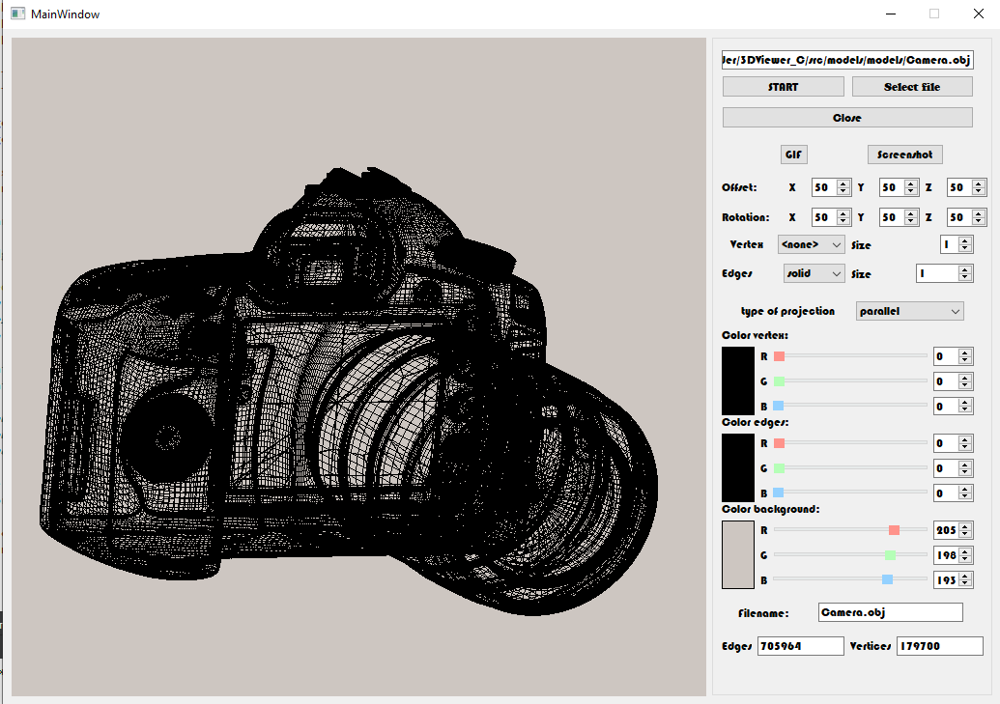

# s21_3D_Viewer

  

## During this project, we developed a program that allows you to view .obj files in 3D. The program automatically parses objects, and allows you to rotate, zoom in and out of objects from the camera.

# Using

To work, you need to download the file by clicking the appropriate button.

To control the camera you can use:
- Rotate the object with the mouse;

| Keys | Action |
| ----- | ----- |
| LMB     | Moves the camera |
| RMB     | Moves the camera around the object |

# Settings

In the settings you are allowed to change the type of projection, type of lines, change the color of the lines, change the type and color of the vertices as well as the color of the background.
You can also work with the object through the corresponding settings, setting the location of the object.

# Makefile

- `install`  : Compiles and installs the application
- `uninstall`: Deletes the application
- `open` : Runs the application
- `test` : Runs tests
- `dvi`  : RUns Configuration of 3dviewer
- `style`: Runs clang-format all files
- `leaks`: Runs valgrind all files

