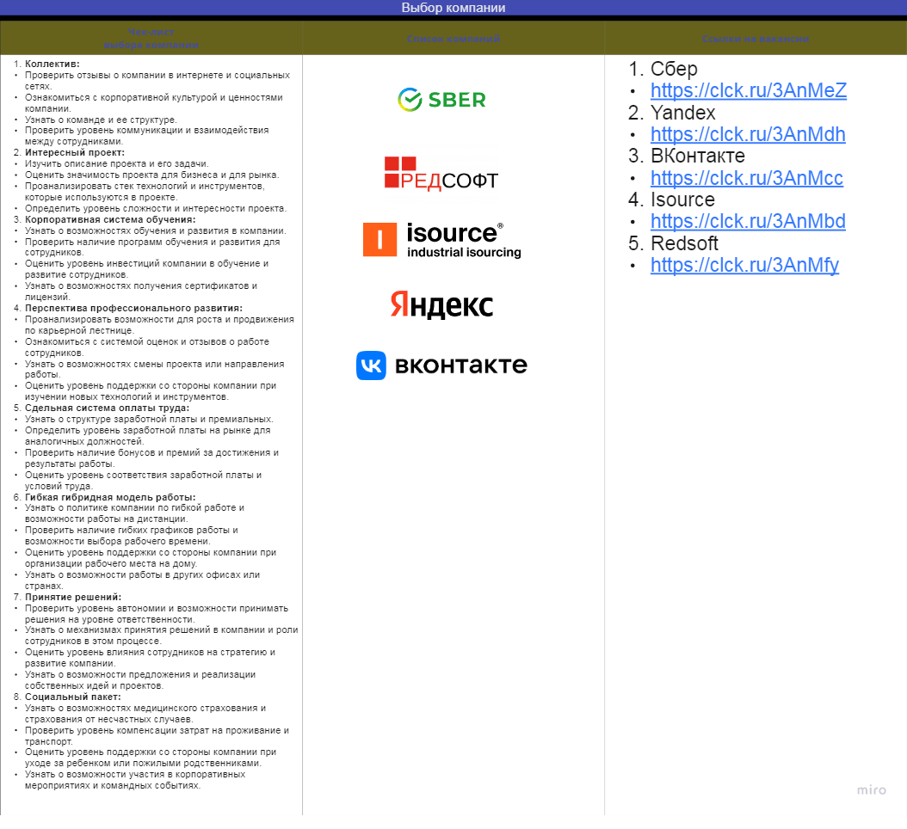
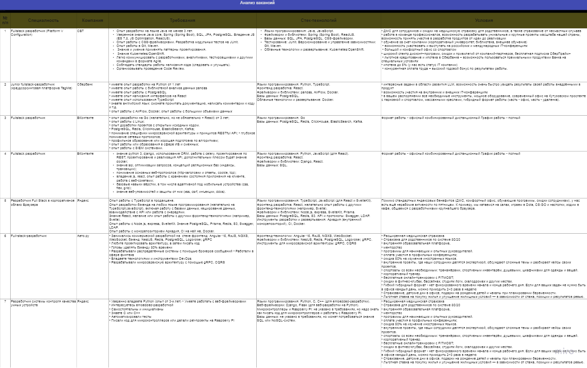
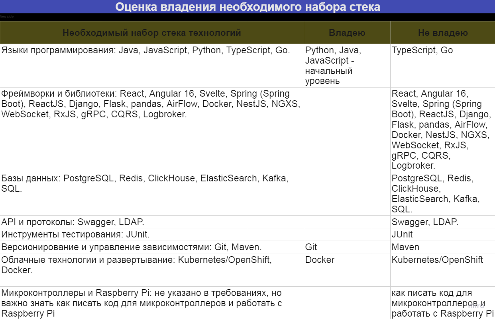
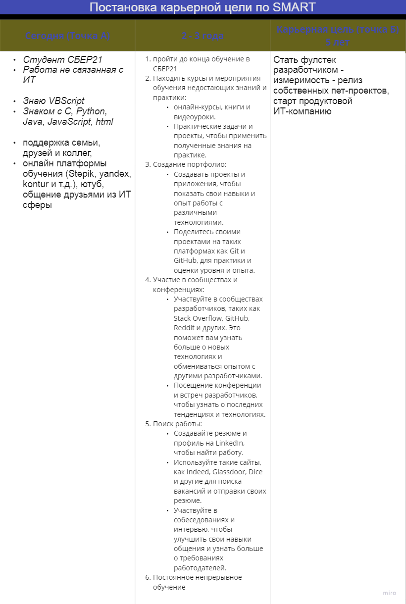
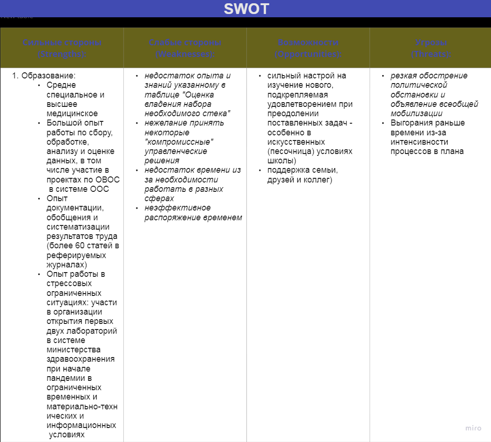

# Career track. Project 01

Ссылка на miro: https://clck.ru/3Anafh
 
## Exercise 00 
### Колесо карьерного баланса

## Exercise 01
### Карьерные цели

## Задача 

Для решения задачи необходимо определиться с поиском работы: российский или зарубежный рынок.
В этом вопросе нет правильных или неправильных ответов. Ты можешь использовать любые помогающие инструменты, задавать больше уточняющих вопросов, записывать, рисовать майнд-мэпы и прийти к итоговой цели. По итогу у тебя должно получится 1-2 вакансии, под которые ты будешь готовить свое резюме.

<h2 id="chapter-v">Chapter V</h2>  

## Exercise 00 
### Выбор компании 

 

## Exercise 01
### Анализ вакансий

1. Создать таблицу «Анализ вакансий» (например, в Google-таблицах — данный инструмент носит рекомендательный характер).
   

 
2. Исходя из требований и обязанностей, которые выписал — определить, какими владеешь, а какими нет.
   

 
3. Вернуться в таблицу карьерных целей и на основании аналитики требований и обязанностей, прописать шаги по достижению целей через 2-3 года.
   

 
   

## Exercise 02
### Анализ навыков

 

