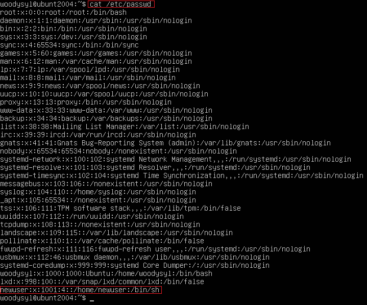
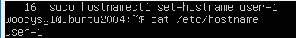
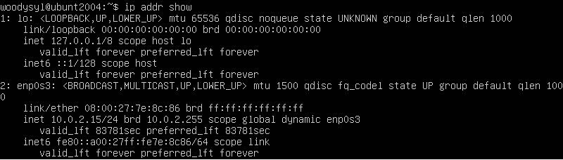
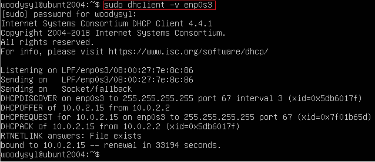
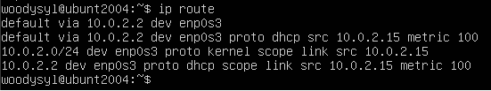
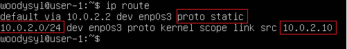
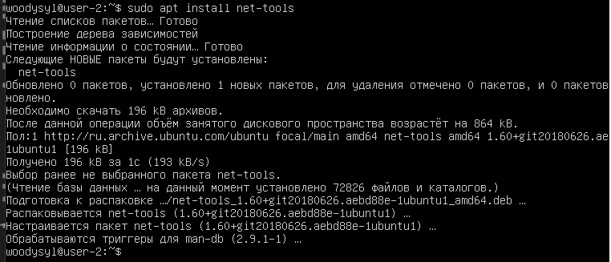

# Отчет по выполненным задачам.

В качестве результата работы ты должен предоставить отчет по выполненным задачам. В каждой части задания указано, что необходимо поместить в отчёт после её выполнения. Это могут быть скриншоты, какие-то данные и т.д.
- В репозиторий, в папку src, должен быть загружен отчёт с расширением .md;
- В отчёте должны быть выделены все части задания, как заголовки 2-го уровня;
- В рамках одной части задания всё, что помещается в отчёт, должно быть оформлено в виде списка;
- Каждый скриншот в отчёте должен быть кратко подписан (что показано на скриншоте);
- Все скриншоты обрезаны так, чтобы была видна только нужная часть экрана.

## Part 1. Установка ОС  
- Cкриншот с выводом команды: 'cat /etc/issue'
    

## Part 2. Создание пользователя  
- Скриншот команды: 'sudo useradd -g adm newuser'
     > *создаем нового пользователя 'newuser' и добавляем в группу 'adm'*
    

  

- Скриншот команды:'cat /etc/passwd'
    

## Part 3. Настройка сети ОС
- Установка названия машины вида 'user-1'
    

- Установка временной зоны, соответствующей текущему местоположению
    

- Вывод названия сетевых интерфейсов с помощью консольной команды.
    > - *Интерфейс lo - это виртуальный сетевой интерфейс, используется для общения процессов сетевого стека на компе.  Имеет IP-адрес 127.0.0.1. "inet6" указывает на то, что следующие параметры относятся к адресу IPv6.'::1/128' - это сам IPv6 адрес и его префиксная длина (длина префикса подсети). 'scope host' указывает на ограничение области видимости адреса, в данном случае - только для локального хоста.*
    > - *Интерфейс enp0s3: link/ether - указывает на тип интерфейса (Ethernet) и его MAC-адрес, 'brd' указывает на широковещательный (broadcast) MAC-адрес для этого интерфейса, 'inet' указывает на IPv4-адрес интерфейса и его префиксную длину (24 бита, что соответствует подсети с маской 255.255.255.0), 'scope global' указывает на область видимости (scope) этого IP-адреса, обозначая, что он является глобальным IP-адресом. "dynamic" указывает, что этот IP-адрес был назначен динамически с использованием протокола DHCP.*
    

    
- Скриншот использование команд, для получения ip адреса устройства от DHCP сервера
    > - *dhclient -v - для получения IP-адреса устройства от DHCP-сервера, флаг -v для более подробной информаци.*
    > - *DHCP это протокол динамической конфигурации хоста, т.е. сетевой протокол, который позволяет устройствам автоматически получать IP-адрес, подсетевую маску, адрес шлюза и другие сетевые параметры от DHCP-сервера, что позволяет упростить процесс настройки сети и управления IP-адресами в компьютерных сетях.*
    

    
- Скриншот - внешний ip-адрес шлюза (ip) и внутренний IP-адрес шлюза, он же ip-адрес по умолчанию (gw)
    > *ip route - отображает полную таблицу маршрутизации, включая внешний IP-адрес шлюза и внутренний IP-адрес шлюза по умолчанию.*
    

     
### Задай статичные (заданные вручную, а не полученные от DHCP сервера) настройки ip, gw, dns (используй публичный DNS серверы, например 1.1.1.1 или 8.8.8.8).
> *Редактируем файл настройки сети /etc/netplan/00-installer-config.yaml*    
- Вывод заданных настроек
    

- После перезагрузки - sudo reboot и сетевые настройки
    >  *Статичные сетевые настройки (ip, gw, dns) соответствуют заданным*   
    

   
- Вывод команды: systemd-resolve --status    
    >  *можно посмотреть текущие настройки DNS-серверов*   
    

    
- Успешно пропингуй удаленные хосты 1.1.1.1 и ya.ru и вставь в отчёт скрин с выводом команды.
  > *В выводе команды должна быть фраза «0% packet loss».*     
  - вывод комманд: 'ping 8.8.8.8' и 'ping 1.1.1.1'
    

   
  - вывод комманд: 'ping ya.ru'
    

   

## Part 4. Обновление ОС   
- Обновление системных пакетов    
    > - *Комманды: sudo apt update, sudo apt upgrade*   
    

  

## Part 5. Использование команды **sudo**
- скрин с изменённым hostname от имени пользователя: 'newuser'    
    > *Истинное назначение команды sudo - состоит в том, что она дает разрешение пользователю на выполнение определенной команды с правами суперпользователя (root) без необходимости входа в учетную запись root.  Обеспечивает безопасное управление системой, поскольку пользователь может получать доступ к суперпользовательским привилегиям только при необходимости;*   
    

  

## Part 6. Установка и настройка службы времени
- Настройка службы автоматической синхронизации времени    
    > *Вывод времени часового пояса. Вывод команды содержит `NTPSynchronized=yes`*   
    

  

## Part 7. Установка и использование текстовых редакторов 
- Установка текстовых редакторов **VIM** (**NANO**, **MCEDIT**)   
  > *Комманда: sudo apt install название редактора*
- Используя каждый из трех редакторов, создал файл *test_X.txt*, где X -- название редактора.
    > *Напиcал свой никнейм, и закрыл файл с сохранением изменений.*
     - **VIM:**
         > *закрытие - 'esc' ':' 'w' 'q'* 
         

  
     - **NANO:**
         > *закрытие - 'ctrl' 'x' 'y'* 
         

  
     - **MCEDIT:**
         > *закрытие - 'esc' 'yes'* 
         

  
- Используя каждый из трех редакторов, отредактируй файлы *test_X.txt*, где X -- название редактора.
    > *отредактировал файл, заменив никнейм на строку «21 School 21», закрыл файл без сохранения изменений.
     - **VIM:**
         > - *редактирование - 'esc' ':' '%s/woodysyl/21 School/g'*
         > - *закрытие - 'esc' ':' 'q' '!'* 
         

  
     - **NANO:**
         > - *редактирование -  'ctrl' '\' 'woodysyl' '21 Schoo 21' Y*
         > - *закрытие - 'ctrl' 'x' 'n'* 
         

  
     - **MCEDIT:**
         > -  *редактирование -  F4 'woodysyl' '21 Schoo 21'*
         > - *закрытие - 'esc' 'no'* 
         

      

## Part 8. Установка и базовая настройка сервиса **SSHD**
- Установка 'SSHd'.  
    > *комманда: sudo apt-get install openssh-server*
- Установка автозапуска службы при загрузке системы.
    > *комманда: sudo systemctl enable ssh*
    

  
- Перенастройка 'SSHd' на порт 2022.
    - Редактируем файл /etc/ssh/sshd_config.
      > *комманда: sudo vim /etc/ssh/sshd_config*
      

     
    - перезагрузка 'SSHd'
      > *комманда: sudo systemctl restart ssh*
- Показ наличия процесса sshd.
    > *команда: ps aux | grep sshd -  выводит список всех процессов и отображаем только связанные с SSH-сервером*
    

- Перезагрузка системы.
    > *команда: sudo reboot*
- Установка  'net-tools' для работы с сетью.
    > *команда: sudo apt install net-tools*
    

- Вывод команды netstat -tan.
    > - *Команда netstat -tan отображает список всех открытых сетевых соединений и портов в формате таблицы.* 
    > - *Значения ключей:*
      > - ***t*** *для TCP портов.*
      > - ***a*** *показать все соединения.*
      > - ***n*** *показать адреса в цифровом значении.*
    > - *Значение каждого столбца вывода следующее:*
      > - *Proto: тип протокола (tcp или udp)*
      > - *Local Address: локальный адрес и порт*
      > - *oreign Address: удаленный адрес и порт*
      > - *State: текущее состояние соединения (например, ESTABLISHED, LISTEN, etc.)*
      > - *Значение 0.0.0.0 в столбце Local Address указывает на то, что сервер "слушает" все доступные сетевые интерфейсы и адреса на указанном порту. Это означает, что сервер готов принимать входящие соединения с любого доступного адреса.*
    

## Part 9. Установка и использование утилит **top**, **htop**
- Вывод команды top.
    > - *uptime: 23 минуты*
    > - *количество авторизованных пользователей: 1*
    > - *общую загрузку системы: 0.07, 0.03, 0.01*
    > - *общее количество процессов: 117*
    > - *загрузку cpu: 0.0 us 0.1 sy 0.0 ni 99.9 id 0.0 wa 0.0 hi 0.0 si 0.0 st*
    > - *загрузку памяти: 3919,5 total 3248,0 free 176,4 used 495,11 buff/cache*
    > - *pid процесса занимающего больше всего памяти: 1*
    > - *pid процесса, занимающего больше всего процессорного времени: 1277*
    

   
- В отчёт вставь скрин с выводом команды htop:
  - отсортированному по:
      - PID
      

      
      - PERCENT_CPU
      

      
      - PERCENT_MEM
      

      
      - TIME
      

      
  - отфильтрованному для процесса sshd  
  

  
  - с процессом syslog, найденным, используя поиск  
  

  
  - с добавленным выводом hostname, clock и uptime  
  

## Part 10. Использование утилиты **fdisk**

- Запуск команды: fdisk -l.
    > - *Название жесткого диска: /dev/sda*
    > - *размер: 25GiB*
    > - *количество секторов: 52428800*
    > - *размер swap: 2.2Gi*
    

## Part 11. Использование утилиты **df**  
- Запуск команды df
  > - *1K-block - единица измерения размера данных или хранения в Linux, составляет 1024 байта или 1 килобайт.*
  

  > - *размер раздела: 11758760 1K-blocks (1kB)*
  > - *размер занятого пространства: 4982920 1K-blocks (1kB)*
  > - *размер свободного пространства: 6156732 1K-blocks (1kB)*
  > - *процент использования: 45%*
- Запустк команды df -Th.
   > - *тип файловой системы для раздела ext4*
  

  
  > - *размер раздела: 12G*
  > - *размер занятого пространства: 4.8G*
  > - *размер свободного пространства: 5.9G*
  > - *процент использования: 45%*

## Part 12. Использование утилиты **du**

##### 

##### 

##### 

## Part 13. Установка и использование утилиты **ncdu**

##### 

##### 

## Part 14. Работа с системными журналами

##### Открой для просмотра:
##### 1. /var/log/dmesg
##### 2. /var/log/syslog
##### 3. /var/log/auth.log  

- 
Mar 22 01:22:28 user-2 sudo: woodysyl : TTY=tty1 : PWD=/home/woodysyl
Mar 22 01:22:28 user-2  sudo: pam_unix(sudo:session): session opened for user root by woodysyl
- sudo systemctl restart sshd;
- 

## Part 15. Использование планировщика заданий **CRON**

##### Используя планировщик заданий, запусти команду uptime через каждые 2 минуты.
- ;
- ;
##### 
