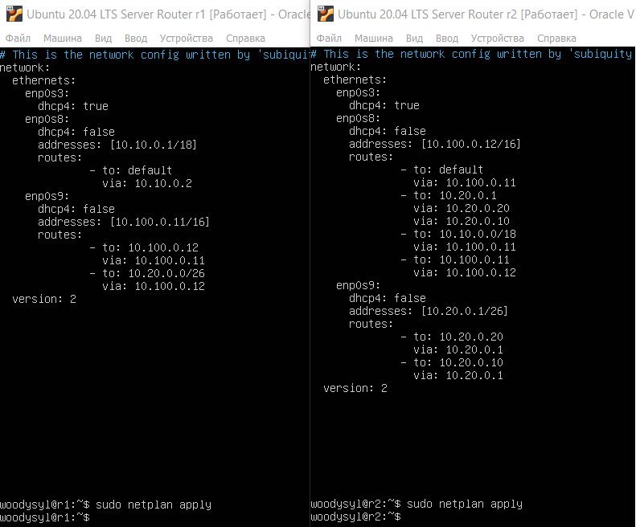
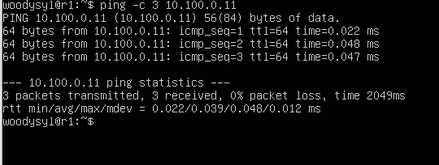

# Отчет по выполненным задачам D02_Linux_network.

> *Дорогие ревьюеры, из этого репорта вы узнаете: как я нашел выход из лабиринта настроек, как избежал падения в черную дыру багов и как не потерял себя в мире командной строки, пока ходил по этому мирному острову стабильности без запинки и смеха!* :neckbeard:

## Part 1. Инструмент **ipcalc**
### 1.1. Сети и маски
  - Адрес сети *192.167.38.54/13*\
  

  - Перевод маски *255.255.255.0*:
    > в префиксной: */24* \
    > в двоичной: *11111111.11111111.11111111.00000000*\

  

  - Перевод маски */15*: 
    > в обычную: *255.254.0.0* \
    > в двоичную: *11111111.11111110.00000000.00000000*\

  

  - Перевод маски *11111111.11111111.11111111.11110000*: 

    > в обычную: *255.255.255.240* \ 
    > в префиксную: */15*\

  

  - Минимальный и максимальный хост в сети *12.167.38.4* 

  > при масках: */8*, *11111111.11111111.00000000.00000000*, *255.255.254.0* и */4*\

  

###1.2. localhost
  > *Oтчёт, можно ли обратиться к приложению, работающему на localhost, со следующими IP:* 
  > - *194.34.23.100* - нет, это внешний ip
  > - *127.0.0.2* - да, 
  > - *127.1.0.1* - да, 
  > - *128.0.0.1* - нет.\
  

### 1.3. Диапазоны и сегменты сетей
1. Какие из перечисленных IP можно использовать в качестве публичного, а какие только в качестве частных: 
   - *10.0.0.45* - частный
   - *134.43.0.2* - публичный
   - *192.168.4.2* - частный
   - *172.20.250.4* - частный
   - *172.0.2.1* - публичный
   - *192.172.0.1* - публичный
   - *172.68.0.2* - публичный
   - *172.16.255.255* - частный
   - *10.10.10.10* - частный
   - *192.169.168.1* - публичный
> *Диапазоны частных IP-адресов:*
  > - *10.0.0.0 - 10.255.255.255*
  > - *172.16.0.0 - 172.31.255.255*
  > - *192.168.0.0 - 192.168.255.255*

2. Какие из перечисленных IP адресов шлюза возможны у сети 10.10.0.0/18:
  - 10.0.0.1 - да
  - 10.10.0.2 - не является частью сети 10.10.0.0/18, так как первые 18 бит отличаются.
  - 10.10.10.10 - да
  - 10.10.100.1 - не является частью сети 10.10.0.0/18
  - 10.10.1.255 - является широковещательным адресом сети 10.10.0.0/18 и не может быть использован в качестве шлюза
> Из wiki: *Исходя из соображений безопасности и обеспечения максимальной пропускной способности сети, на шлюзах может быть установлен запрет транзита пакетов на широковещательные адреса.*

## Part 2. Статическая маршрутизация между двумя машинами

- Команда `ip a` - существующие сетевые интерфейсы ws1 и ws2.\

- Описан сетевой интерфейс, соответствующий внутренней сети, на обеих машинах и задать следующие адреса и маски: ws1 - *192.168.100.10*, маска */16*, ws2 - *172.24.116.8*, маска */12*.

  > скрин с содержанием изменённого файла *etc/netplan/00-installer-config.yaml* для каждой машины.\

  

-  команда `netplan apply` для перезапуска сервиса сети.\

  

#### 2.1. Добавление статического маршрута вручную

-  команды: `ip r add` и  `ping`.\

  

#### 2.2. Добавление статического маршрута с сохранением

##### Перезапусти машины.

- Добавление статического маршрута с помощью файла *etc/netplan/00-installer-config.yaml*.\

  

- Пропингуй соединение между машинами.\

  

## Part 3. Утилита **iperf3**

#### 3.1. Скорость соединения:

    - 8 Mbps = 1 MB/s
    - 100 MB/s = 819200 Kbps
    - 1 Gbps = 1024 Mbps

#### 3.2. Утилита **iperf3**

- скорость соединения между ws1 и ws2.\

    

## Part 4. Сетевой экран

#### 4.1. Утилита **iptables**
- Файл */etc/firewall.sh*, имитирующий фаерволл, на `ws1` и `ws2`:\
   

- Запуск файлы на обеих машинах командами `chmod +x /etc/firewall.sh` и `/etc/firewall.sh`.\
    

    > Если сначала стоит запрещающее правило, то оно имеет приоритет перед последующим разрешающим.

#### 4.2. Утилита **nmap**
- Cкрины с вызовом и выводом использованных команд **ping** и **nmap**.\

    

    > *Проверка: в выводе nmap должно быть сказано: `Host is up`*.

## Part 5. Статическая маршрутизация сети

##### Подними пять виртуальных машин (3 рабочие станции (ws11, ws21, ws22) и 2 роутера (r1, r2)).

#### 5.1. Настройка адресов машин

##### Настрой конфигурации машин в *etc/netplan/00-installer-config.yaml* согласно сети на рисунке.

- В отчёт помести скрины с содержанием файла *etc/netplan/00-installer-config.yaml* для каждой машины.\

    

##### Проверка командой `ip -4 a`, и `ping` ws22 с ws21. Аналогично пропингуй r1 с ws11.
  - скрины с вызовом и выводом использованных команд\

  

.

#### 5.2. Включение переадресации IP-адресов

  - выполнение команды `sysctl -w net.ipv4.ip_forward=1`на роутерах:\

  

.

  > *При таком подходе переадресация не будет работать после перезагрузки системы.*

  - содержание изменённого файла */etc/sysctl.conf*.\

  

.

  > *При использовании этого подхода, IP-переадресация включена на постоянной основе.*

#### 5.3. Установка маршрута по-умолчанию

  - Настройка маршрута по-умолчанию (шлюз) для рабочих станций. Содержание файла *etc/netplan/00-installer-config.yaml*;\

  

.

  - Вызов и вывод `ip r`\

  

.

  - Вызов и вывод `ping` и `tcpdump -tn -i eth0`\

  

.

#### 5.4. Добавление статических маршрутов

  - Добавь в роутеры r1 и r2 статические маршруты в файле конфигураций. Пример для r1 маршрута в сетку 10.20.0.0/26:\

  - содержание изменённого файла *etc/netplan/00-installer-config.yaml* для каждого роутера.\

  

.

  - скрин с вызовом и выводом `ip r` на обоих роутерах. \

  

.

  - скрин с вызовом и выводом  на ws11: `ip r list 10.10.0.0/18` и `ip r list 0.0.0.0/0`\

  

.

  > Для адреса 10.10.0.0/18 был выбран маршрут, отличный от 0.0.0.0/0, потому что при наличии нескольких маршрутов одинаковой длины выбирается тот маршрут, который задан наиболее точно.

#### 5.5. Построение списка маршрутизаторов

  - cкрин с вызовом и выводом использованных команд (tcpdump и traceroute);\
  
  

.

  > Принцип работы построения пути при помощи **traceroute**:\
    - Traceroute это утилита, служащая для диагностики сети. Она отслеживает пути, по которым пакеты данных проходят от источника к хосту назначенияпо протоколу UDP (User Datagram Protocol – «протокол пользовательских датаграмм») Traceroute отправляет последовательность IP-пакетов. Всего таких пакетов по умолчанию может быть 3.\
    - Первый пакет имеет время жизни (также известное как TTL (Time To Live) или лимит переходов), равное 1, второй пакет имеет TTL=2 и так далее.\
    - Каждый раз, когда пакет передается новому маршрутизатору, TTL уменьшается на 1. Это сделано для предотвращения проблем с зацикливанием между серверами. Если бы не было TTL, пакет мог бы бесконечно долго перебрасываться между серверами.\
    - Когда время жизни достигает 0, пакет отбрасывается, а маршрутизатор возвращает сообщение об ошибке. 

#### 5.6. Использование протокола **ICMP** при маршрутизации

  - Скрин с вызовом и выводом  `tcpdump -n -i eth0 icmp` и `ping -c 1 10.30.0.111`.\

  

.

## Part 6. Динамическая настройка IP с помощью **DHCP**

  - скрин настройки r2 в файле */etc/dhcp/dhcpd.conf* конфигурацию службы **DHCP** и скрин настройки  ws11 в файле *etc/netplan/00-installer-config.yaml*

  > Адрес маршрутизатора по-умолчанию, DNS-сервер и адрес внутренней сети.\

  

.

  - скрины В файле *resolv.conf* пропиши `nameserver 8.8.8.8`.\

  

.

  - вызов и вывод комманд `systemctl restart isc-dhcp-server`. Машину ws21 перезагрузи при помощи `reboot` и через `ip a` покажи, что она получила адрес. Также пропингуй ws22 с ws21.\

  

.\

  

.\

  

.\

- Для r1 настрой аналогично r2, но сделай выдачу адресов с жесткой привязкой к MAC-адресу (ws11). Проведи аналогичные тесты.\

 

.\

 

.\

- Запроси с ws21 обновление ip адреса.\

 

.

## Part 7. **NAT**

.

.

.

.

. 

.

.

## Part 8. Дополнительно. Знакомство с **SSH Tunnels**

.

.

.

.

.

.
