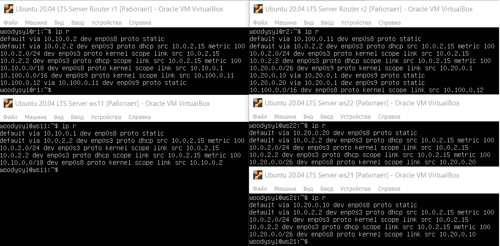

# Отчет по выполненным задачам D02_Linux_network.

{width=100%}

> *Дорогие ревьюеры, из этого репорта вы узнаете: как я нашел выход из лабиринта настроек, как избежал падения в черную дыру багов и как не потерял себя в мире командной строки, пока ходил по этому мирному острову стабильности без запинки и смеха!* :neckbeard:

## Part 1. Инструмент **ipcalc**
### 1.1. Сети и маски
  - Адрес сети *192.167.38.54/13*
  {width=50%}

    - Перевод маски *255.255.255.0*:
    > в префиксной: */24* \
    > в двоичной: *11111111.11111111.11111111.00000000*
    {width=50%}
    - Перевод маски */15*: 
    > в обычную: *255.254.0.0* \
    > в двоичную: *11111111.11111110.00000000.00000000*
    {width=50%}

    - Перевод маски *11111111.11111111.11111111.11110000*: 
    > в обычную: *255.255.255.240* \ 
    > в префиксную: */15*
    {width=50%}

  - Минимальный и максимальный хост в сети *12.167.38.4* 
  > при масках: */8*, *11111111.11111111.00000000.00000000*, *255.255.254.0* и */4*
  {width=50%}

###1.2. localhost
  > *Oтчёт, можно ли обратиться к приложению, работающему на localhost, со следующими IP:* 
  > - *194.34.23.100* - нет, это внешний ip
  > - *127.0.0.2* - да, 
  > - *127.1.0.1* - да, 
  > - *128.0.0.1* - нет.
  {width=50%}

### 1.3. Диапазоны и сегменты сетей
1. Какие из перечисленных IP можно использовать в качестве публичного, а какие только в качестве частных: 
   - *10.0.0.45* - частный
   - *134.43.0.2* - публичный
   - *192.168.4.2* - частный
   - *172.20.250.4* - частный
   - *172.0.2.1* - публичный
   - *192.172.0.1* - публичный
   - *172.68.0.2* - публичный
   - *172.16.255.255* - частный
   - *10.10.10.10* - частный
   - *192.169.168.1* - публичный
> *Диапазоны частных IP-адресов:*
  > - *10.0.0.0 - 10.255.255.255*
  > - *172.16.0.0 - 172.31.255.255*
  > - *192.168.0.0 - 192.168.255.255*

2. Какие из перечисленных IP адресов шлюза возможны у сети 10.10.0.0/18:
  - 10.0.0.1 - да
  - 10.10.0.2 - не является частью сети 10.10.0.0/18, так как первые 18 бит отличаются.
  - 10.10.10.10 - да
  - 10.10.100.1 - не является частью сети 10.10.0.0/18
  - 10.10.1.255 - является широковещательным адресом сети 10.10.0.0/18 и не может быть использован в качестве шлюза
> Из wiki: *Исходя из соображений безопасности и обеспечения максимальной пропускной способности сети, на шлюзах может быть установлен запрет транзита пакетов на широковещательные адреса.*

## Part 2. Статическая маршрутизация между двумя машинами

- Команда `ip a` - существующие сетевые интерфейсы ws1 и ws2.
{width=50%}

- Описан сетевой интерфейс, соответствующий внутренней сети, на обеих машинах и задать следующие адреса и маски: ws1 - *192.168.100.10*, маска */16*, ws2 - *172.24.116.8*, маска */12*.
  > скрин с содержанием изменённого файла *etc/netplan/00-installer-config.yaml* для каждой машины.\
  {width=50%}
-  команда `netplan apply` для перезапуска сервиса сети.
  {width=50%}

#### 2.1. Добавление статического маршрута вручную
-  команды: `ip r add` и  `ping`.
  {width=50%}

#### 2.2. Добавление статического маршрута с сохранением
##### Перезапусти машины.
- Добавление статического маршрута с помощью файла *etc/netplan/00-installer-config.yaml*.
  {width=50%}
- Пропингуй соединение между машинами.
  {width=50%}

## Part 3. Утилита **iperf3**

#### 3.1. Скорость соединения:
    - 8 Mbps = 1 MB/s
    - 100 MB/s = 819200 Kbps
    - 1 Gbps = 1024 Mbps

#### 3.2. Утилита **iperf3**
- скорость соединения между ws1 и ws2.\
    {width=50%}

## Part 4. Сетевой экран

#### 4.1. Утилита **iptables**
- Файл */etc/firewall.sh*, имитирующий фаерволл, на `ws1` и `ws2`:
   {width=50%}


- Запуск файлы на обеих машинах командами `chmod +x /etc/firewall.sh` и `/etc/firewall.sh`.
    {width=50%}
    > Если сначала стоит запрещающее правило, то оно имеет приоритет перед последующим разрешающим.

#### 4.2. Утилита **nmap**
- Cкрины с вызовом и выводом использованных команд **ping** и **nmap**.

    {width=50%}
    > *Проверка: в выводе nmap должно быть сказано: `Host is up`*.


## Part 5. Статическая маршрутизация сети

##### Подними пять виртуальных машин (3 рабочие станции (ws11, ws21, ws22) и 2 роутера (r1, r2)).

#### 5.1. Настройка адресов машин
##### Настрой конфигурации машин в *etc/netplan/00-installer-config.yaml* согласно сети на рисунке.
- В отчёт помести скрины с содержанием файла *etc/netplan/00-installer-config.yaml* для каждой машины.
    {width=50%}

##### Проверка командой `ip -4 a`, и `ping` ws22 с ws21. Аналогично пропингуй r1 с ws11.
- скрины с вызовом и выводом использованных команд
    {width=50%}.


#### 5.2. Включение переадресации IP-адресов
- выполнение команды `sysctl -w net.ipv4.ip_forward=1`на роутерах:
  {width=50%}.
  > *При таком подходе переадресация не будет работать после перезагрузки системы.*

- содержание изменённого файла */etc/sysctl.conf*.
  {width=50%}.
  > *При использовании этого подхода, IP-переадресация включена на постоянной основе.*

#### 5.3. Установка маршрута по-умолчанию
- Настройка маршрута по-умолчанию (шлюз) для рабочих станций. Содержание файла *etc/netplan/00-installer-config.yaml*;
  {width=50%}.
- Вызов и вывод `ip r`
  {width=50%}.
- Вызов и вывод `ping` и `tcpdump -tn -i eth0`
  {width=50%}.


#### 5.4. Добавление статических маршрутов
- Добавь в роутеры r1 и r2 статические маршруты в файле конфигураций. Пример для r1 маршрута в сетку 10.20.0.0/26:
```shell
# Добавь в конец описания сетевого интерфейса eth1:
- to: 10.20.0.0
  via: 10.100.0.12
```
- В отчёт помести скрины с содержанием изменённого файла *etc/netplan/00-installer-config.yaml* для каждого роутера.
##### Вызови `ip r` и покажи таблицы с маршрутами на обоих роутерах. Пример таблицы на r1:
```
10.100.0.0/16 dev eth1 proto kernel scope link src 10.100.0.11
10.20.0.0/26 via 10.100.0.12 dev eth1
10.10.0.0/18 dev eth0 proto kernel scope link src 10.10.0.1
```
- В отчёт помести скрин с вызовом и выводом использованной команды.
##### Запусти команды на ws11:
`ip r list 10.10.0.0/[маска сети]` и `ip r list 0.0.0.0/0`
- В отчёт помести скрин с вызовом и выводом использованных команд;
- В отчёте объясни, почему для адреса 10.10.0.0/\[маска сети\] был выбран маршрут, отличный от 0.0.0.0/0, хотя он попадает под маршрут по-умолчанию.

#### 5.5. Построение списка маршрутизаторов
Пример вывода утилиты **traceroute** после добавления шлюза:
```
1 10.10.0.1 0 ms 1 ms 0 ms
2 10.100.0.12 1 ms 0 ms 1 ms
3 10.20.0.10 12 ms 1 ms 3 ms
```
##### Запусти на r1 команду дампа:
`tcpdump -tnv -i eth0`
##### При помощи утилиты **traceroute** построй список маршрутизаторов на пути от ws11 до ws21.
- В отчёт помести скрины с вызовом и выводом использованных команд (tcpdump и traceroute);
- В отчёте, опираясь на вывод, полученный из дампа на r1, объясни принцип работы построения пути при помощи **traceroute**.

#### 5.6. Использование протокола **ICMP** при маршрутизации
##### Запусти на r1 перехват сетевого трафика, проходящего через eth0 с помощью команды:
`tcpdump -n -i eth0 icmp`
##### Пропингуй с ws11 несуществующий IP (например, *10.30.0.111*) с помощью команды:
`ping -c 1 10.30.0.111`
- В отчёт помести скрин с вызовом и выводом использованных команд.

##### Сохрани дампы образов виртуальных машин.
**P.S. Ни в коем случае не сохраняй дампы в гит!**

## Part 6. Динамическая настройка IP с помощью **DHCP**

`-` Следующим нашим шагом будет более подробное знакомство со службой **DHCP**, которую ты уже знаешь.

**== Задание ==**

*В данном задании используются виртуальные машины из Части 5.*

##### Для r2 настрой в файле */etc/dhcp/dhcpd.conf* конфигурацию службы **DHCP**:
##### 1) Укажи адрес маршрутизатора по-умолчанию, DNS-сервер и адрес внутренней сети. Пример файла для r2:
```shell
subnet 10.100.0.0 netmask 255.255.0.0 {}

subnet 10.20.0.0 netmask 255.255.255.192
{
    range 10.20.0.2 10.20.0.50;
    option routers 10.20.0.1;
    option domain-name-servers 10.20.0.1;
}
```
##### 2) В файле *resolv.conf* пропиши `nameserver 8.8.8.8`.
- В отчёт помести скрины с содержанием изменённых файлов.
##### Перезагрузи службу **DHCP** командой `systemctl restart isc-dhcp-server`. Машину ws21 перезагрузи при помощи `reboot` и через `ip a` покажи, что она получила адрес. Также пропингуй ws22 с ws21.
- В отчёт помести скрины с вызовом и выводом использованных команд.

##### Укажи MAC адрес у ws11, для этого в *etc/netplan/00-installer-config.yaml* надо добавить строки: `macaddress: 10:10:10:10:10:BA`, `dhcp4: true`.
- В отчёт помести скрин с содержанием изменённого файла *etc/netplan/00-installer-config.yaml*.
##### Для r1 настрой аналогично r2, но сделай выдачу адресов с жесткой привязкой к MAC-адресу (ws11). Проведи аналогичные тесты.
- В отчёте этот пункт опиши аналогично настройке для r2.
##### Запроси с ws21 обновление ip адреса.
- В отчёте помести скрины ip до и после обновления.
- В отчёте опиши, какими опциями **DHCP** сервера пользовался в данном пункте.

##### Сохрани дампы образов виртуальных машин.
**P.S. Ни в коем случае не сохраняй дампы в гит!**

## Part 7. **NAT**
`-` Ну и в конце в качестве вишенки на торте я расскажу тебе про механизм преобразования адресов.

**== Задание ==**

*В данном задании используются виртуальные машины из Части 5.*
##### В файле */etc/apache2/ports.conf* на ws22 и r1 измени строку `Listen 80` на `Listen 0.0.0.0:80`, то есть сделай сервер Apache2 общедоступным.
- В отчёт помести скрин с содержанием изменённого файла.
##### Запусти веб-сервер Apache командой `service apache2 start` на ws22 и r1.
- В отчёт помести скрины с вызовом и выводом использованной команды.
##### Добавь в фаервол, созданный по аналогии с фаерволом из Части 4, на r2 следующие правила:
##### 1) Удаление правил в таблице filter - `iptables -F`;
##### 2) Удаление правил в таблице "NAT" - `iptables -F -t nat`;
##### 3) Отбрасывать все маршрутизируемые пакеты - `iptables --policy FORWARD DROP`.
##### Запусти файл также, как в Части 4.
##### Проверь соединение между ws22 и r1 командой `ping`.
*При запуске файла с этими правилами, ws22 не должна «пинговаться» с r1.*
- В отчёт помести скрины с вызовом и выводом использованной команды.
##### Добавь в файл ещё одно правило:
##### 4) Разрешить маршрутизацию всех пакетов протокола **ICMP**.
##### Запусти файл также, как в Части 4.
##### Проверь соединение между ws22 и r1 командой `ping`.
*При запуске файла с этими правилами, ws22 должна «пинговаться» с r1.*
- В отчёт помести скрины с вызовом и выводом использованной команды.
##### Добавь в файл ещё два правила:
##### 5) Включи **SNAT**, а именно маскирование всех локальных ip из локальной сети, находящейся за r2 (по обозначениям из Части 5 - сеть 10.20.0.0).
*Совет: стоит подумать о маршрутизации внутренних пакетов, а также внешних пакетов с установленным соединением.*
##### 6) Включи **DNAT** на 8080 порт машины r2 и добавить к веб-серверу Apache, запущенному на ws22, доступ извне сети.
*Совет: стоит учесть, что при попытке подключения возникнет новое tcp-соединение, предназначенное ws22 и 80 порту.*
- В отчёт помести скрин с содержанием изменённого файла.
##### Запусти файл также, как в Части 4.
*Перед тестированием рекомендуется отключить сетевой интерфейс **NAT** (его наличие можно проверить командой `ip a`) в VirtualBox, если он включен.*
##### Проверь соединение по TCP для **SNAT**: для этого с ws22 подключиться к серверу Apache на r1 командой:
`telnet [адрес] [порт]`
##### Проверь соединение по TCP для **DNAT**: для этого с r1 подключиться к серверу Apache на ws22 командой `telnet` (обращаться по адресу r2 и порту 8080).
- В отчёт помести скрины с вызовом и выводом использованных команд.

##### Сохрани дампы образов виртуальных машин.
**P.S. Ни в коем случае не сохраняй дампы в гит!**

## Part 8. Дополнительно. Знакомство с **SSH Tunnels**

`-` Пожалуй, на этом у меня всё. Может, у тебя появились ещё какие-то вопросы?

`-` Да, я хотел спросить ещё об одной вещи. На работе я краем уха услышал, что в моей компании есть некие проекты по обучению. Подробностей я не знаю, но очень хочется взглянуть... Вдруг будет полезно.

`-` Действительно интересно, но как в этом помогу тебе я?

`-` Дело в том, что, чтобы добраться до этих проектов, нужно получить доступ к закрытой сети. Можешь посоветовать что-нибудь по этому поводу?

`-` Ну ты, конечно, даёшь... Не уверен на все сто, что это поможет, но могу рассказать тебе про **SSH Tunnels**.

**== Задание ==**

*В данном задании используются виртуальные машины из Части 5.*

##### Запусти на r2 фаервол с правилами из Части 7.
##### Запусти веб-сервер **Apache** на ws22 только на localhost (то есть в файле */etc/apache2/ports.conf* измени строку `Listen 80` на `Listen localhost:80`).
##### Воспользуйся *Local TCP forwarding* с ws21 до ws22, чтобы получить доступ к веб-серверу на ws22 с ws21.
##### Воспользуйся *Remote TCP forwarding* c ws11 до ws22, чтобы получить доступ к веб-серверу на ws22 с ws11.
##### Для проверки, сработало ли подключение в обоих предыдущих пунктах, перейди во второй терминал (например, клавишами Alt + F2) и выполни команду:
`telnet 127.0.0.1 [локальный порт]`
- В отчёте опиши команды, необходимые для выполнения этих четырёх пунктов, а также приложи скриншоты с их вызовом и выводом.

##### Сохрани дампы образов виртуальных машин.
**P.S. Ни в коем случае не сохраняй дампы в гит!**

## Chapter IV

`-` Спасибо тебе большое за помощь!

`-` Всегда пожалуйста! Мне тоже было не лишним вспомнить основы администрирования. Я решил освоить что-нибудь новое и заняться DevOps'ом.

`-` Ого! Уже нашёл, куда устроиться?

`-` Да, правда, придётся переехать. Так что в следующий раз тебе придётся осваивать все самому.

`-` Рано или поздно мне всё равно пришлось бы начать, так что, может, это только к лучшему. Потом обязательно созвонимся - расскажешь о своих успехах!

`-` А ты о своих!

\> *Ты ещё какое-то время болтаешь с Себастьяном на отвлеченные темы, слушая приятную музыку и допивая заказанный напиток, после чего прощаешься...*
