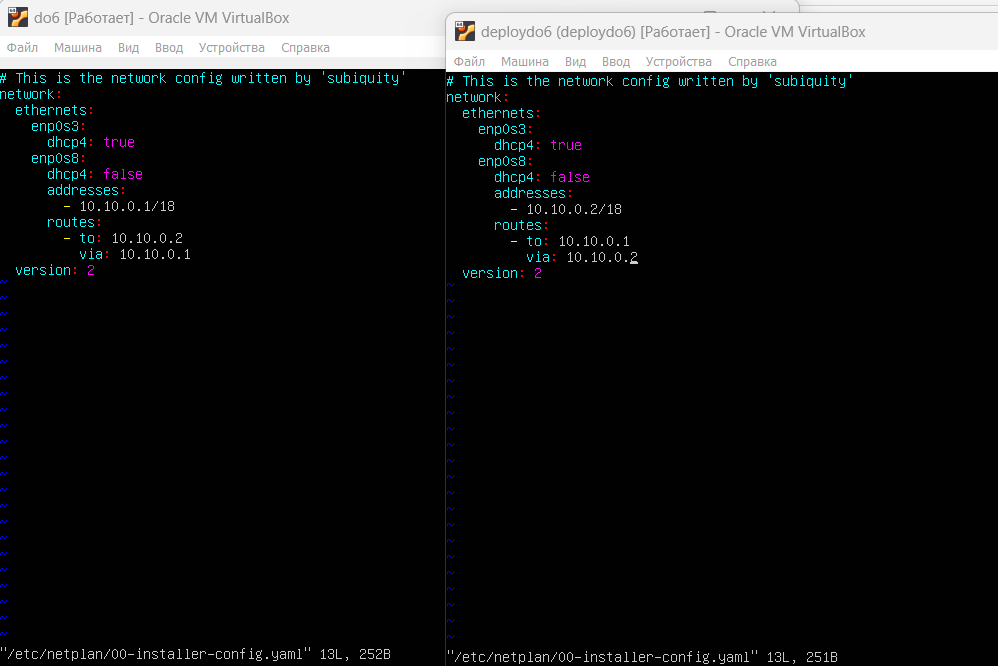
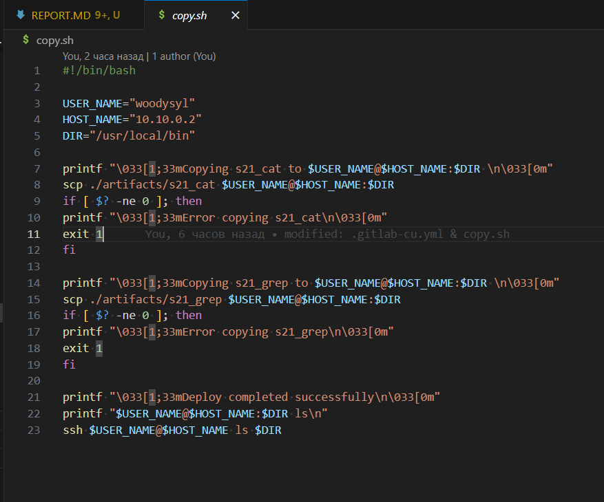
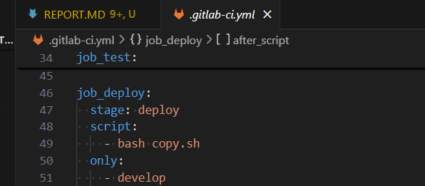
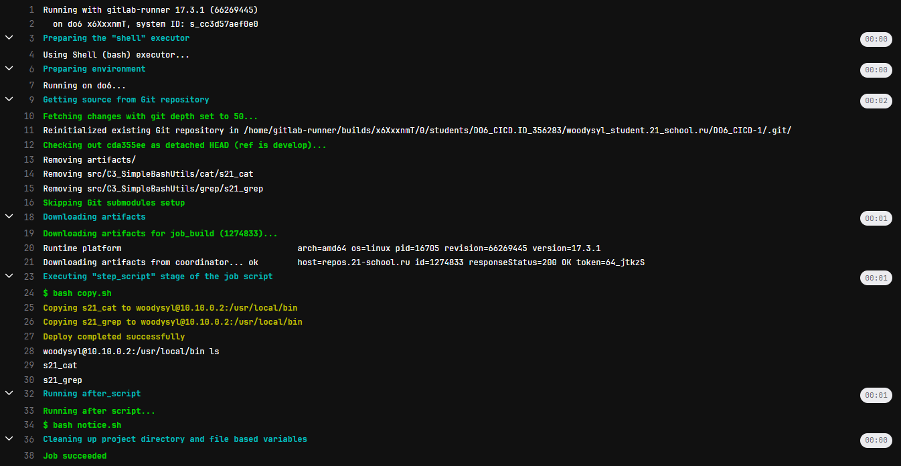
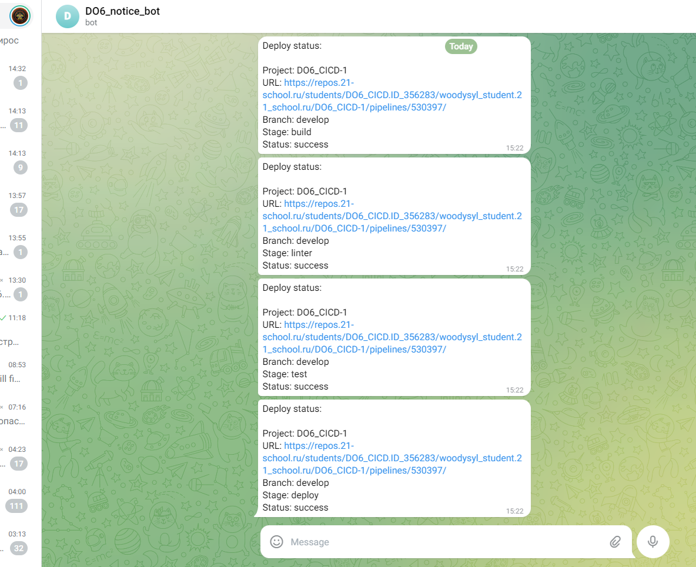

# Отчет по выполненным задачам D06_Basic CI/CD

{width=100%}

> *Дорогие ревьюеры, из этого репорта вы узнаете: как я нашел выход из лабиринта настроек, как избежал падения в черную дыру багов и как не потерял себя в мире командной строки, пока ходил по этому мирному острову стабильности без запинки и смеха!* :neckbeard:

## Part 1. Настройка **gitlab-runner**

- Поднимаем виртуальную машину *Ubuntu Server 22.04 LTS*

### Загрузка и установка на виртуальную машину **gitlab-runner**

- открываем <https://docs.gitlab.com/runner/install/linux-repository.html> и следуем инструкции

### Запусти **gitlab-runner** и зарегистрируй его для использования в текущем проекте (*DO6_CICD*)

- открываем <https://docs.gitlab.com/ee/tutorials/create_register_first_runner/> и следуем инструкции
- Региструем URL и токен, которые получаем на страничке проекта.

## Part 2. Сборка

### Напиши этап для **CI** по сборке приложений из проекта *C3_SimpleBashUtils*

- переносим *C3_SimpleBashUtils* в *./src/*
- открываем *gitlab-ci.yml* который создаем в корне проекта и добавляем этапы сборки
- В файле *gitlab-ci.yml* добавляем этап запуска сборки через мейк файл из проекта *C3*
- Файлы, полученные после сборки (артефакты), сохраняем в директорию *artifacts* со сроком хранения 30 дней
    >job_build:
    >stage: build

    >script:
    > - rm -rf artifacts
    > - mkdir artifacts
    > - (cd ./src/C3_SimpleBashUtils/cat/ && make s21_cat)
    > - (cd ./src/C3_SimpleBashUtils/grep/ && make s21_grep)
    > - cp src/C3_SimpleBashUtils/cat/s21_cat src/    C3_SimpleBashUtils/grep/s21_grep artifacts/

    >artifacts:\
    >paths:
    > - artifacts
    >expire_in: 30 days

    >only:
    >- develop

## Part 3. Тест кодстайла

- Добавлыем этап для **CI**, который запускает скрипт кодстайла (*clang-format*) через мейк файл из проекта *C3*
- Если кодстайл не проходит, то пайплайн «зафейлится» и отобразится вывод утилиты *clang-format*

    > job_linter:\
    > stage: linter\
    > script:
    > - (cd src/C3_SimpleBashUtils/cat && make style)
    > - (cd src/C3_SimpleBashUtils/grep && make style)

    > only:
    > - develop

### Part 4. Интеграционные тесты

- также добавляем этап для **CI**, который запускает интеграционные тесты через мейк файл из проекта *C3*, если сборка и тест кодстайла прошли успешно, если тесты не прошли, то пайплайн «зафейлится»
    > job_test:\
    > stage: test\
    > script:
    > - (cd src/C3_SimpleBashUtils/cat && make leaks)
    > - (cd src/C3_SimpleBashUtils/cat && make test)
    > - (cd src/C3_SimpleBashUtils/grep && make leaks)
    > - (cd src/C3_SimpleBashUtils/grep && make test)

    > only:
    > - develop

### Part 5. Этап деплоя

- Поднимаем вторую виртуальную машину *Ubuntu Server 22.04 LTS*
- Настраеваем сеть
    {width=100%}
- Переходим в юзера gitlab-runner
    > sudo su gitlab-runner\
    > генерируем ssh-ключ: *ssh-keygen*\
    > Пробрасываем ключ серверу *ssh-copy-id woodysyl@10.10.0.2*

    > На сервере даём права к директории: /usr/local/bin chmod 777 /usr/local/bin
- Настраиваем все файлы:
    {width=100%}
    {width=100%}

- В случае ошибки пайплайн «зафейлится»

В результате получаем готовые к работе приложения из проекта *C2_SimpleBashUtils* (s21_cat и s21_grep) на второй виртуальной машине.
    {width=100%}

## Part 6. Дополнительно. Уведомления

- Для настройки уведомления об успешном/неуспешном выполнении пайплайна через бота в *Telegram* следуем инструкции *../materials/notifications_RUS.md*
    > токен бота и id юзера сохранил в перемменных env виртуальной машину do6, так-как указанные в инструкции настройки проекта в данном случае не доступны (может не нашел)
- скрипт также следуем инструкции из *../materials/notifications_RUS.md*

- Текст уведомления должен содержать информацию об успешности прохождения как этапа **CI**, так и этапа **CD**.
    {width=100%}

{width=100%}
